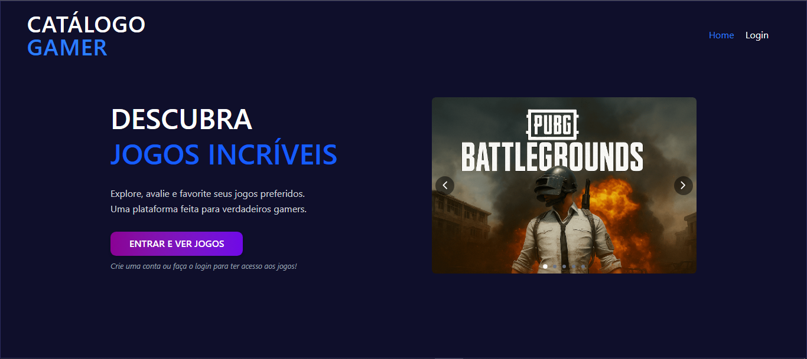
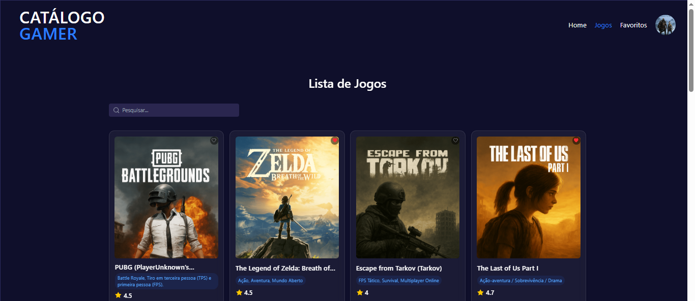
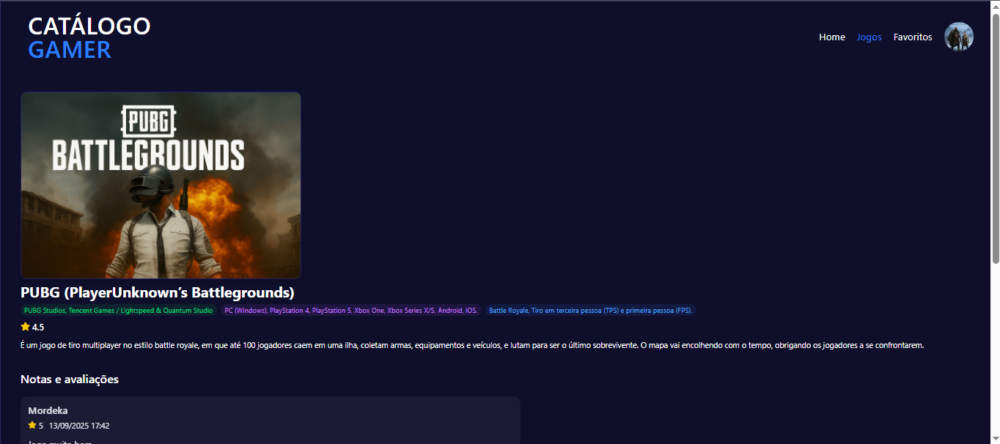
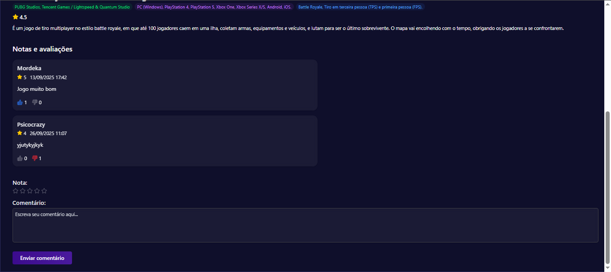
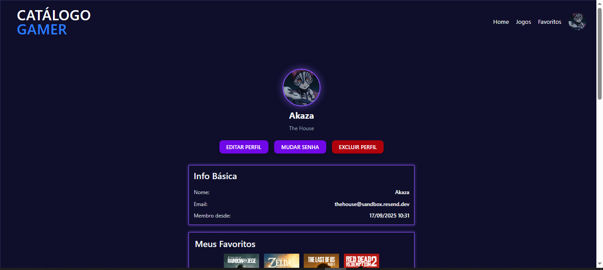
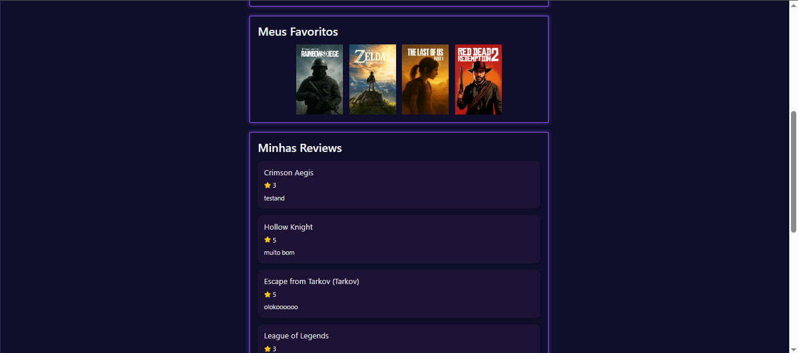
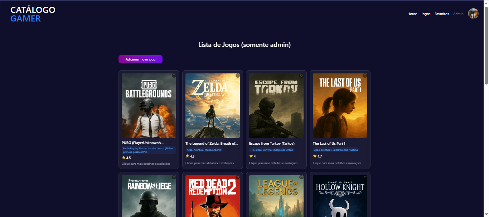
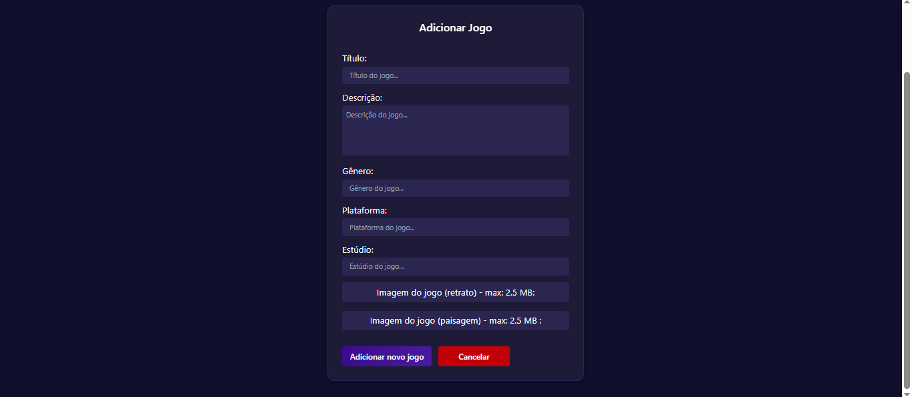
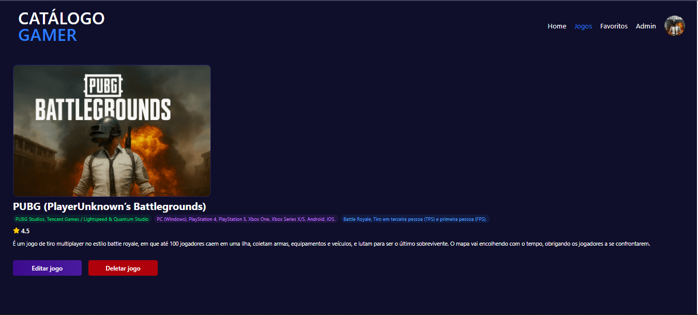

# 🎮 Catálogo Gamer

Aplicação **fullstack** para **catalogar(admin), favoritar e avaliar jogos**, com sistema completo de **autenticação, reações (like/dislike)** e **controle de acesso** para administradores e usuários comuns. Usuários podem **gerenciar seu perfil** (foto, senha e e-mail), **acompanhar suas avaliações** e **visualizar seus jogos favoritados.**

---

## 🎯 Propósito do Projeto

O **Catálogo de jogos** foi desenvolvido com o objetivo de consolidar conhecimentos em **desenvolvimento fullstack**, integrando **frontend (React, Vite e Tailwind)** com **backend (Node.js, Express e bancos relacionais).**
O foco principal foi compreender o fluxo completo de uma aplicação moderna: desde o **login e controle de sessão com JWT**, até o **CRUD de jogos e usuários, favoritos, sistema de avaliações** e **gestão de perfil.**
O projeto utiliza **MySQL em ambiente de desenvolvimento** e **PostgreSQL (Neon.tech) em produção**, garantindo compatibilidade entre bancos e um deploy completo na **Vercel**.

---

## 🧰 Linguagens e Tecnologias

### Frontend

<p align="left">
  


</p>

<br>

### Versionamento e ferramentas

<p>
    
    
    
</p>

<br>
  
### Backend
<p>
    
    
</p>

<br>
  
### Bancos de dados
<p>
    
    
</p>

<br>
<br>

> 💾 **Banco de dados:**
>
> - 🧪 Desenvolvimento: **MySQL (local)**
> - 🚀 Produção: **PostgreSQL (Neon.tech)**

---

## 💡 Funcionalidades

- Cadastro/Login de usuários
- CRUD completo de jogos
- Favoritos (salvar/remover)
- Avaliações/Comentários e reações (like/dislike)
- Filtros e busca por nome
- Controle de acesso (admin x usuário comum)
- Integração completa entre frontend e backend

---

## 🌐 Deploy

- Catálogo de Jogos: [https://catalogo-gamer.vercel.app/](https://catalogo-gamer.vercel.app/)

---

## 🏗️ Arquitetura do Projeto

```text
Frontend (React + Vite + Tailwind)
           ↓
         Axios
           ↓
Backend (Node.js + Express)
           ↓
Banco de Dados
├─ 💻 Desenvolvimento → MySQL (local)
└─ ☁️ Produção → PostgreSQL (Neon.tech)
```

---

## 🖼️ Pré-visualização

<p align="center">
  <div align="center">
     <em>Home</em>
     <br>
     
  </div>
  <br>

  <div align="center">
     <em>Page Games</em>
     <br>
     
  </div>
  <br>

  <div align="center">
     <em>Reviews</em>
     <br>
     
  </div>
  <br>

  <div align="center">
     <em>Reviews</em>
     <br>
     
  </div>
  <br>

  <div align="center">
     <em>Profile</em>
     <br>
     
  </div>
  <br>

  <div align="center">
     <em>Profile</em>
     <br>
     
  </div>
  <br>

  <div align="center">
     <em>Admin</em>
     <br>
     
  </div>
  <br>

  <div align="center">
     <em>Add new Game</em>
     <br>
     
  </div>
  <br>

  <div align="center">
     <em>Edit game</em>
     <br>
     
  </div>
</p>

---

## 🧠 Aprendizados

Durante o desenvolvimento deste projeto, pratiquei:
- Integração entre **frontend e backend** utilizando **Axios**;
- **Autenticação e autorização** com **JWT**;
- **Relacionamentos entre tabelas** (usuário ↔ jogos ↔ avaliações), (usuário ↔ jogos ↔ favoritos);
- Deploy completo com **Vercel** e **Neon.tech**;
- Configuração de ambientes distintos (**MySQL local** e **PostgreSQL em produção**);
- Estilização responsiva e componentização com **Tailwind CSS**.

---

## 👨‍💻 Autor

Desenvolvido por **[Guilherme Giovani](https://github.com/guilhermegiovani).**  
Projeto criado com o objetivo de praticar e demonstrar habilidades em **React**, **Node.js**, **Express**, **TailwindCSS**, **MySQL** e **PostgreSQL (Neon.tech)**.
